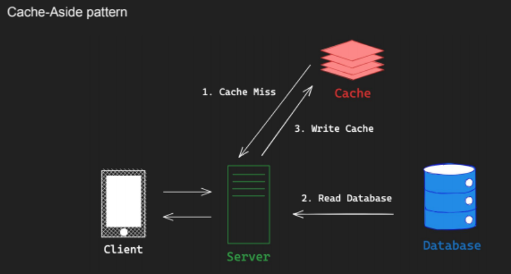

# Redis 알아보기

## Remote Dictionary Sever

### 특징

-   In-Memory 모든 데이터를 RAM에 저장 (백업 / 스냅샷 제외)
-   Single Threaded 단일 thread에서 모든 task 처리
-   Cluster Mode 다중 노트에 데이터를 분산 저장하여 안정성 & 고가용성 제공
-   Persistence RDB(Redis Database) + AOF(Append Only file)통해 영속성 옵션 제공
-   Pub/Sub Pub/Sub 패턴을 지원하여 손쉬운 어플리케이션 개발(e.g 채팅, 알림등)

### 장점

-   높은 성능 모든데이터를 메모리에 저장하기 때문에
-   Data Type 지원 Redis에서 지원하는 Data Type을 활용하여 다양한 기능 지원
-   클라이언트 라이브러리 다양한 안어로 작성된 클라이언트 라이브 러리 지원
-   참고 자료 많음

### 주요 사용 사례

-   Caching
    -   임시 비밀번호 , 로그인 세션
-   Rate Limiter
    -   Fixed-Window / Sliding-Window Rate Limiter(비율 계산기)
-   Message Broker
    -   메시지 큐
-   실시간 분석 / 계산

    -   순위표
    -   반경 탐색
    -   방문자 수 계산

-   실시간 채팅
    -   Pub/Sub패턴

### Persistence(영속성)

Redis는 주로 캐시로 사용되지만 데이터 영속성을 위한 옵션 제공 SSD와 같은 영구적인 저장 장치에 데이터 저장

-   RDB(Redis Database) : 특정 지점의 스냅샷 제공 -> 일부 데이터 유실 있을 수 있음 재난 복구 복제에 사용
-   AOF(Append Only File) : Redis에 적용되는 쓰기작업 log로 저장 데이터 유실 위험이 적지만 재난 복구시 쓰기작업을 다시 적용하기 때문에 RDB보다 느림
-   둘 모두 함께 사용하는 옵션 제공

### Caching

캐싱 : 데이터를 빠르게 읽고 처리하기 위해 임시로 저장하는 기술 계산된 값을 임시 저장

