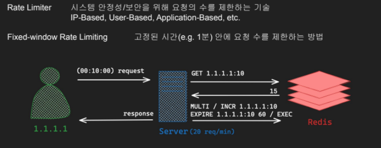
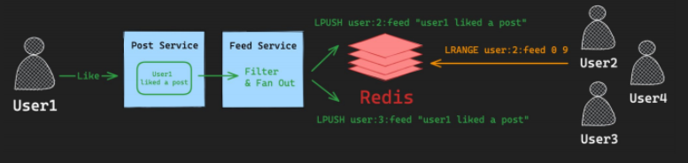
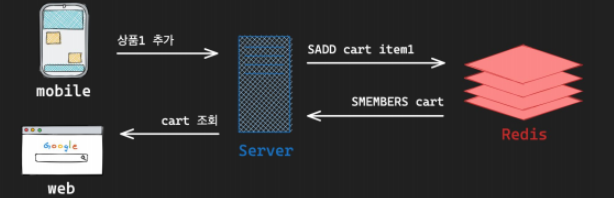
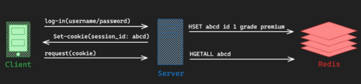
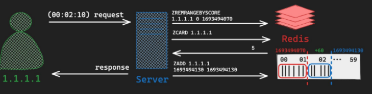
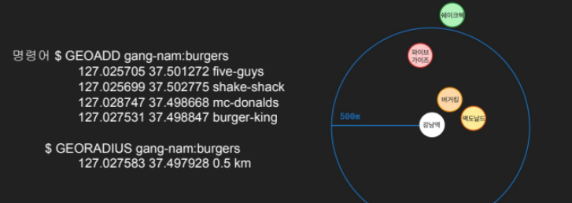
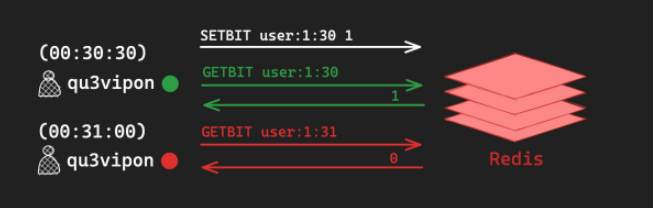
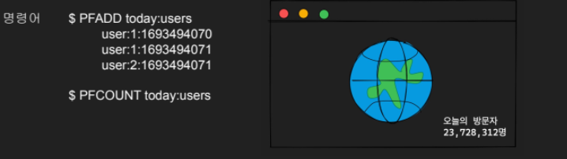
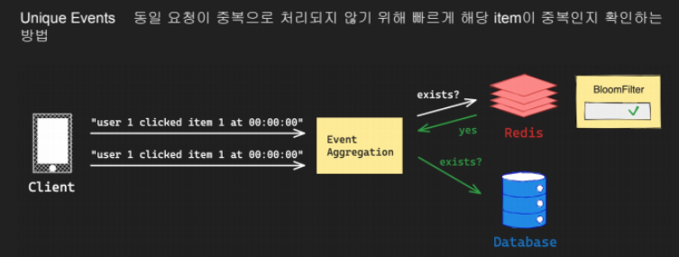

# 데이터 타입 활용

## One-Time Password(String)

One-Time Password : 인증을 위해 사용되는 임시 인증 번호 키값으로 이메일이나 휴대전화 번호 주고 값으로 랜덤값주면 되겠다

```
$ SET 010-1123-4444:otp 123456 EX 180
```

## Distributed Lock(String)

Distributed Lock : 분산락

```
$ SET lock 1 NX // 락걸기
$ SET lock 1 NX -> 오류발생

$ DEL lock // 락해제
```

## Rate Limiter(String)

Rate Limiter : 시스템 안정성/보안을 위해 요청의 수를 제한하는 기술 ex. ip,user...

Fixed-window Rate Limitin -> 고정된 시간안에 요청 수를 제한하는 방법

```
00:10:00  request요청시
$ 1.1.1.1:10 -> 여기에 10분터 요청한 횟수 기록(한시간 단위로 끊기)
ex. 최대 20회로 제한할경우 해당 키 값비교 해서 처리하면 될듯

```



## SNS Active Feed(List)

Active Feed : 사용자 또는 시스템과 관련된 활동이나 업데이트를 시간순으로 정렬하여 보여주는 기능

Fan-Out : 단일 데이터를 한 소스에서 여러 목적지로 동시에 전달하는 메시징 패턴



## Shopping Cart(Set)

Shopping Cart : 사용자가 구매를 원하는 상품을 임시로 모아두는 가상의 공간 수시로 변경이 발생할 수 있고, 실제 구매로 이어지지 않을 수 있다.



## Login Session(Hash)



## Sliding Window Rate Limiter(Sorted Set 점수대신 초로)

Sliding Window Rate Limiter : 시간에 따라 Window를 이동시켜 동적으로 요청수를 조절하는 기술

Fixed Window보다 구현이 어렵지단 훨씬 유동적


## Geofencing(Geospatial)

Geofencing 위치를 활용하여 지도상의 가상의 경계 또는 지리적 영역을 정의하는 기술



## Online Status(Bitmap)

사용자의 현재 상태를 표시하는 기능 (실시간성 보장 x 수시로 변경되는 값)


## Visitors Count(HyperLogLog)

Visitors Count Approximation : 방문자수 (또는 특정 횟수)를 대략적으로 추정하는 경우
정확한 횟수를 셀 필요 없이 대략적인 어림치만 알고자 하는 경우


## Unique Event(BloopFilter)

동일 요청이 중복으로 처리되지 않기 위해 빠르게 해당 item이 중복인지 확인하는 방법

