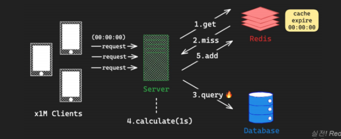
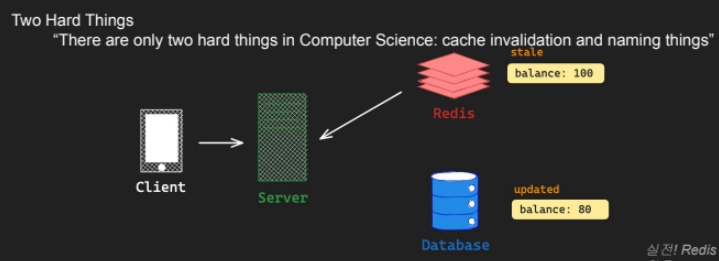

# Redis 사용시 주의사항

## O(N)명령어

대부분의 명령어는 O(1)시간 복잡도를 갖지만 , 일부의 경우 O(N)

Redis는 Single Thread로 명령어를 순차적으로 수행하기 때문에, 오래 걸리는 O(N) 명령어 수행시, 전체적인 성능 저하

ex.

-   KEYS -> 지정된 패턴과 일치하는 모든 KEY 조회 Production환경에서 절대 사용금지 -> SCAN 명령어로 대체

-   SMEMBERS -> Set의 모든 member 반환 set이 크면 분할하자

-   HGETALL -> Hash의 모든 field 반환 크면 분할하자

-   SORT -> List, Set, ZSet의 Item정렬해서 반환

## Thundering Herd Problem

Thundering Herd Problem : 병렬 요청이 공유 자원에 대해서 접근할 때, 급격한 과부하가 발생하는 문제 (캐시 관리도 잘해야함 방지하려면)

## Stable Cache Invalidation

Stable Cache Invalidation : 캐시의 유효성이 손실되었거나 변경되었을때, 캐시를 변경하거나 삭제해야함!

